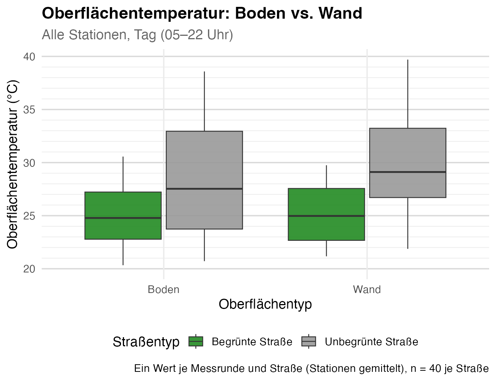
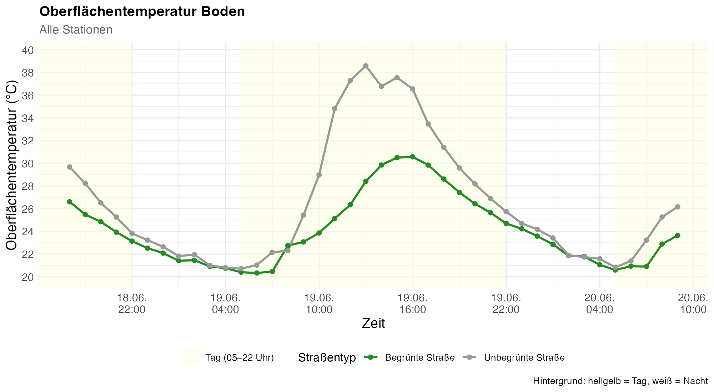
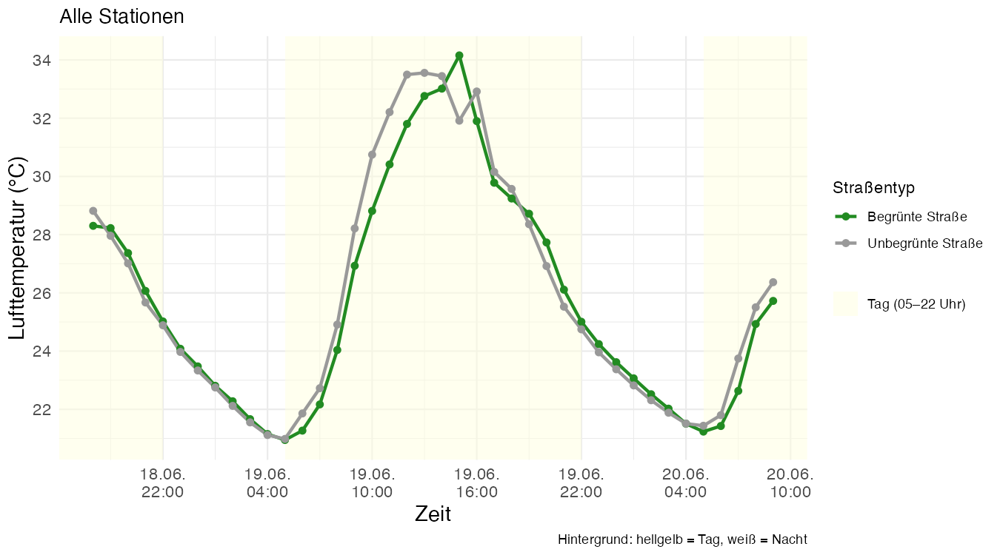
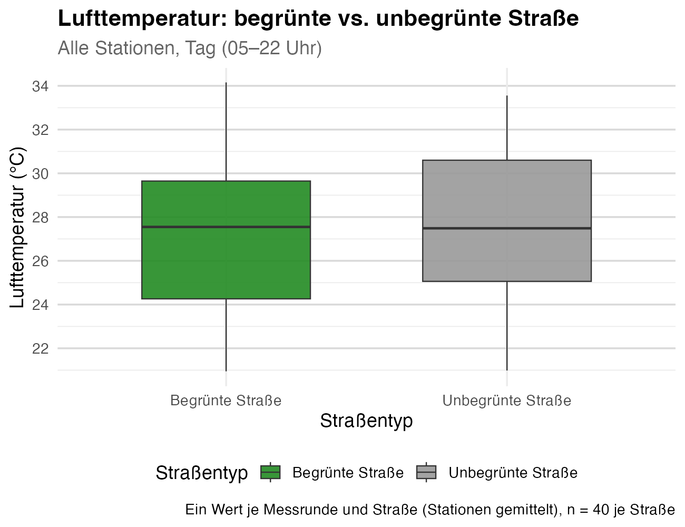
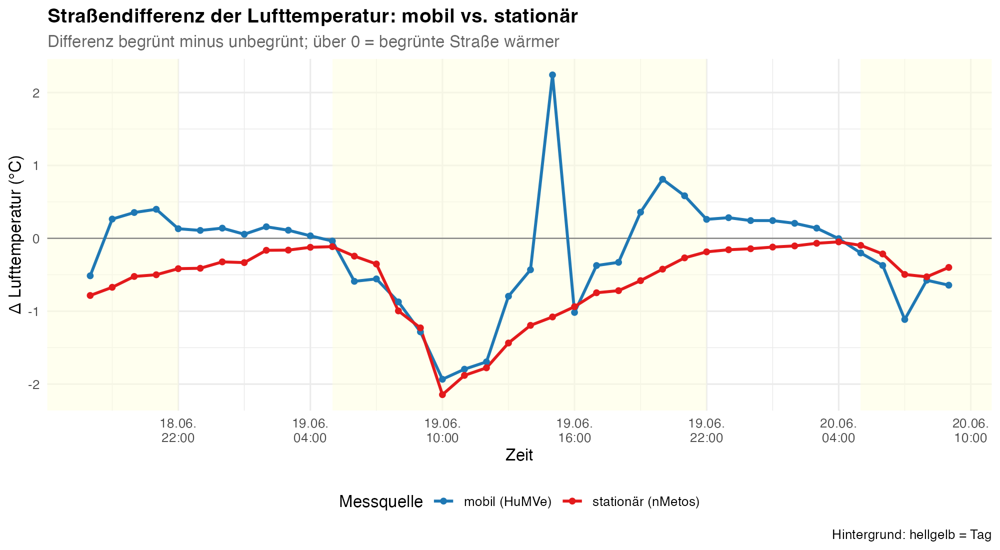
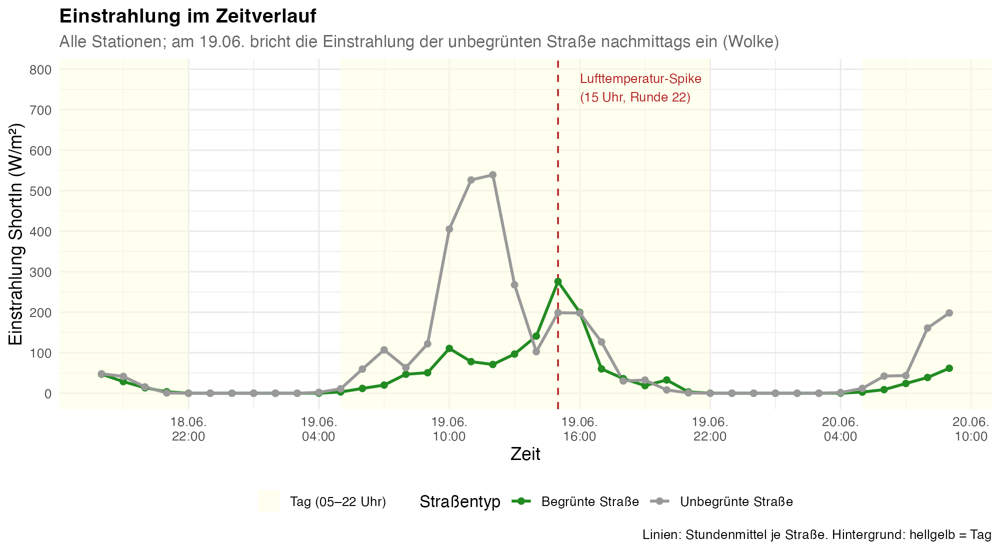

# 3 Ergebnisse

Die Ergebnisse folgen dem roten Faden der Hypothesen: zuerst die Oberflächentemperatur (H1), dann
die Lufttemperatur (H2). Alle Differenzen sind als unbegrünt minus begrünt angegeben, ein positiver
Wert bedeutet also, dass die baumlose Straße wärmer ist.

## 3.1 Oberflächentemperatur (H1)

Die Oberflächentemperatur unterscheidet sich stark zwischen den Straßen, und zwar deutlich abhängig
von der Tageszeit. Abbildung 1 zeigt die Verteilung tagsüber für Boden und Wand. In beiden Fällen
liegt die baumlose Straße klar höher, und ihre Werte streuen zugleich viel breiter, mit Ausreißern
bis knapp 40 °C. Die baumbestandene Straße bleibt kühler und gleichmäßiger.

**Abbildung 1:** Oberflächentemperatur von Boden und Wand tagsüber (05 bis 22 Uhr), begrünte
(grün) gegen unbegrünte Straße (grau), alle Stationen. Ein Wert je Messrunde und Straße (n = 40 je
Straße). Die Box umfasst die mittleren 50 Prozent der Werte, die Linie darin ist der Median.

Über den Tagesverlauf (Abbildung 2, Beispiel Boden) wird das Muster noch deutlicher. Nachts liegen
beide Linien fast übereinander. Sobald die Sonne aufgeht, heizt sich die baumlose Straße stark auf
und erreicht am frühen Nachmittag ihr Maximum, während die beschattete Straße viel kühler bleibt. Am
Nachmittagshöhepunkt am 19.06. betrug der Unterschied beim Boden rund 10,9 °C (26,3 gegen 37,3 °C um
12 Uhr) und bei der Wand rund 10,5 °C (29,2 gegen 39,7 °C um 16 Uhr). Nachts verschwindet der
Unterschied fast vollständig.

**Abbildung 2:** Bodenoberflächentemperatur im Zeitverlauf über die gesamte Kampagne, begrünte
(grün) gegen unbegrünte Straße (grau), alle Stationen. Der gelbe Hintergrund markiert den Tag
(05 bis 22 Uhr). Die Wand zeigt ein ähnliches Muster mit ihrem Maximum am späteren Nachmittag.

Die statistische Prüfung bestätigt das (Tabelle 1). Tagsüber ist die baumlose Straße im Mittel um
3,44 °C (Boden) und 4,63 °C (Wand) wärmer, beide Unterschiede sind hochsignifikant. Nachts bleibt
ein kleiner, aber ebenfalls signifikanter Rest von 0,44 °C (Boden) und 0,86 °C (Wand). H1 wird damit
klar bestätigt.

**Tabelle 1:** Mittlere Differenz der Oberflächentemperatur (unbegrünt minus begrünt) und gepaarter
t-Test pro Runde, alle Stationen. Positiv bedeutet baumlose Straße wärmer.

| Oberfläche | Tageszeit | Differenz (°C) | t | df | p |
|------------|-----------|----------------|-----|----|-----|
| Boden | Gesamt | +2,39 | 5,12 | 39 | 8,7e-06 |
| Boden | Tag | +3,44 | 5,46 | 25 | 1,1e-05 |
| Boden | Nacht | +0,44 | 5,31 | 13 | 1,4e-04 |
| Wand | Gesamt | +3,31 | 7,51 | 39 | 4,4e-09 |
| Wand | Tag | +4,63 | 9,12 | 25 | 2,0e-09 |
| Wand | Nacht | +0,86 | 4,68 | 13 | 4,3e-04 |

## 3.2 Lufttemperatur (H2)

Bei der Lufttemperatur fällt der Unterschied viel kleiner aus. Abbildung 3 zeigt den mobilen
Zeitverlauf: die beiden Linien liegen fast durchgehend dicht beieinander, die baumlose Straße nur
knapp über der begrünten. Auch im Boxplot tagsüber (Abbildung 4) überlappen sich die Verteilungen
stark. Der Kühleffekt der Bäume ist bei der Luft also nur schwach ausgeprägt.

**Abbildung 3:** Lufttemperatur im Zeitverlauf (mobile Messung), begrünte (grün) gegen unbegrünte
Straße (grau), alle Stationen, Stundenmittel. Der Ausschlag am 19.06. gegen 15 Uhr wird in Abschnitt
3.3 behandelt.

**Abbildung 4:** Lufttemperatur tagsüber (05 bis 22 Uhr), begrünte gegen unbegrünte Straße, alle
Stationen, ein Wert je Runde (n = 40 je Straße).

Tabelle 2 fasst die Zahlen zusammen. In der mobilen Messung ist die baumlose Straße tagsüber im
Mittel nur 0,42 °C wärmer, über den Gesamtzeitraum ist der Unterschied mit 0,22 °C nicht signifikant.
Die stationären Stationen, die kontinuierlich und gleichzeitig messen, zeigen einen etwas größeren und
klar signifikanten Unterschied von 0,58 °C im Mittel und 0,78 °C tagsüber. Beide unabhängigen
Messsysteme stimmen also in der Richtung überein: die baumlose Straße ist etwas wärmer, aber der
Effekt ist klein. H2 wird tendenziell bestätigt, jedoch mit deutlich schwächerer Ausprägung als bei
der Oberfläche.

Nachts fällt der Befund uneinheitlich aus. In der mobilen Messung ist die begrünte Straße nachts sogar
minimal wärmer (0,15 °C), in den stationären Daten dagegen die baumlose (0,20 °C). Beide Werte sind
sehr klein und werden in der Diskussion eingeordnet.

**Tabelle 2:** Mittlere Differenz der Lufttemperatur (unbegrünt minus begrünt) und gepaarter t-Test
pro Runde, für die mobile und die stationäre Messung.

| Quelle | Tageszeit | Differenz (°C) | t | df | p |
|--------|-----------|----------------|-----|----|-----|
| mobil | Gesamt | +0,22 | 1,74 | 39 | 0,089 |
| mobil | Tag | +0,42 | 2,28 | 25 | 0,031 |
| mobil | Nacht | −0,15 | −6,42 | 13 | 2,3e-05 |
| stationär | Gesamt | +0,58 | 6,92 | 39 | 2,7e-08 |
| stationär | Tag | +0,78 | 7,25 | 25 | 1,3e-07 |
| stationär | Nacht | +0,20 | 6,04 | 13 | 4,2e-05 |

## 3.3 Ein Ausschlag in der mobilen Messung

In der mobilen Lufttemperatur (Abbildung 3) fällt am 19.06. gegen 15 Uhr ein kurzer Ausschlag auf,
bei dem die begrünte Straße plötzlich wärmer erscheint als die baumlose. Abbildung 5 stellt die
Straßendifferenz der mobilen und der stationären Messung nebeneinander. Beide Quellen stimmen zu
jeder Stunde überein, die begrünte Straße ist kühler, mit einer einzigen Ausnahme: um 15 Uhr springt
allein der mobile Wert nach oben (auf +2,24 °C), während die stationäre Messung glatt bei −1,08 °C
bleibt. Der Ausschlag existiert also nur in der mobilen Messung.

**Abbildung 5:** Straßendifferenz der Lufttemperatur (begrünt minus unbegrünt) für die mobile (blau)
und die stationäre Messung (rot). Über 0 bedeutet begrünte Straße wärmer. Nur die mobile Kurve zeigt
um 15 Uhr einen Ausschlag.

Ein Blick auf die Einstrahlung (Abbildung 6) liefert die Erklärung. Am frühen Nachmittag bricht die
Einstrahlung der baumlosen Straße plötzlich ein, von rund 355 W/m² um 12 Uhr auf 87 W/m² um 14 Uhr,
und erholt sich danach wieder. Das ist das Muster einer durchziehenden Wolke. Wie dieser Einbruch mit
dem Messdesign zusammenwirkt, wird in der Diskussion erläutert.

**Abbildung 6:** Kurzwellige Einstrahlung im Zeitverlauf, begrünte (grün) gegen unbegrünte Straße
(grau), alle Stationen, Stundenmittel. Am 19.06. am frühen Nachmittag bricht die Einstrahlung der
baumlosen Straße kurz ein.
